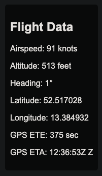
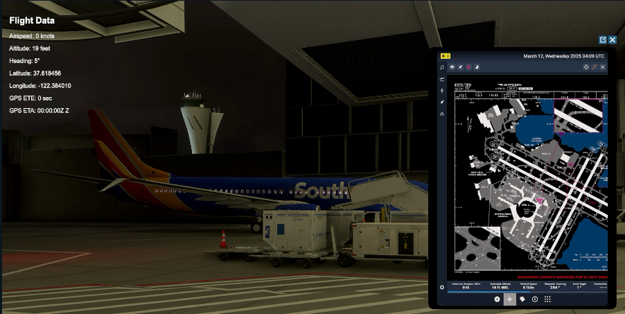

# Flight Sim Overlay ✈️

I created this repo to track progress on a project for my fellow flight simulator enthusiasts. It provides a **free, customizable overlay** for flight simulator video recordings or live streams that displays basic telemetry data about the aircraft and the active flight. It currently uses SimConnect to access this data.

## Features:
- ~~Customizable telemetry overlay for flight simulator recordings or live streams~~ (not yet!)
- Server-side code written in Python
- Client-side HTML overlay viewable in any browser or streaming software (works great in Streamlabs Desktop on macOS!)

## Setup 🛠️

### Server-side Setup:
1. Download the repo to your server machine (the machine running the flight simulator).
2. Run `server.py` on the server side.
      `python server.py`
### Client-side Setup:
1.  Open `index.html` in a browser or add it as a browser object in your streaming software.
2.  Update the `serverIP` value on **line 41** of `index.html` to the IP or name of your sim machine.
    -   If you're streaming from the same PC you're running the sim on, change it to `localhost:5000`.
`<!-- Update this line to match your server IP -->`
``
### Customization 🚀
-   There is no customization for now as this is merely a **proof of concept**.
-   I love Volanta's overlays, but I dislike the paywall and the fact that their overlay only works on the same machine you run the sim on.
-   While I know there's a way to grab or forward the websocket data stream, I'm having much more fun creating my own to share with fellow simmers!

If you haven't already and since you're already here, check out my other project: 
[GeoShottr](https://github.com/teezyyoxo/geoshottr).
*Automatically add location data to your in-sim screenshots!*

*Please* feel free to submit a pull request if you'd like to help with styling and/or add new features!
----------
And remember, friends – in the name of Kelsey (74Gear), **keep the blue side up**.
Enjoy, and happy flying! ✈️ 🎮